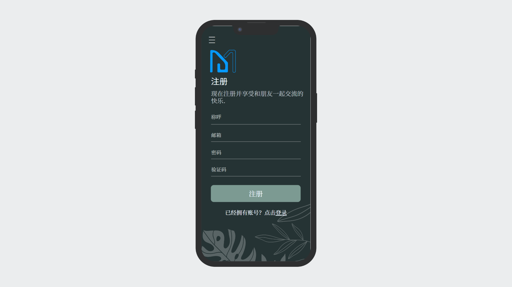
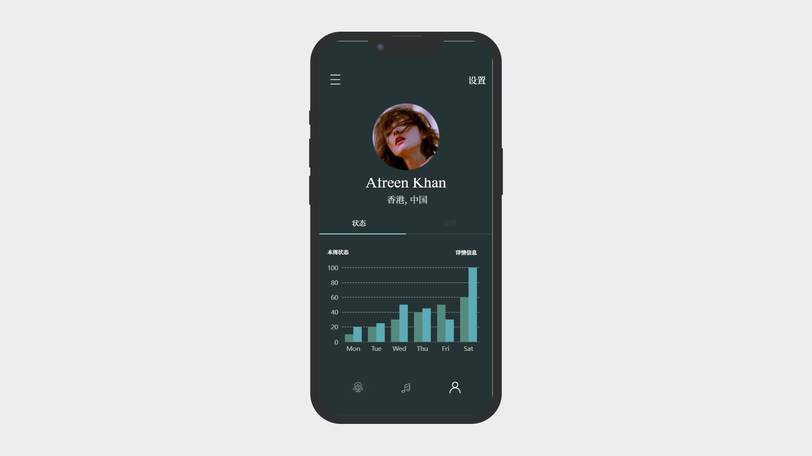

# MindMeet软件需求规格说明书

[toc]

## 1. 引言

### 1.1 目的

**MindMeet**软件是一款旨在帮助用户管理时间、提高生产力和实现个人目标的应用程序。本软件将提供时间管理、专注、日程规划、打卡与成就、进度跟踪等一系列功能，以及社交、分享、监督、奖励、私聊等社交功能，以满足用户对于时间管理和个人成长的需求。

### 1.2 范围

本文档将描述**MindMeet**软件的目标用户、功能需求、用例、活动流程的相关信息。

### 1.3 专业术语

|   术语   |                            解释                            |
| :------: | :--------------------------------------------------------: |
| MindMeet |     本软件的名称，意为促进思想交流和分享的时间管理平台     |
|   SRS    | 软件需求规格说明书（Software Requirements Specification）  |
|    UI    |                 用户界面（User Interface）                 |
|   API    |     应用程序接口（Application Programming Interface）      |
|  日程表  |                   用来记录用户日程的对象                   |
|   社区   | 一个互相联系的社会群体，在网络社区中成员可以进行交流和协作 |
|  自习室  |    用户可以创建、加入的虚拟自习空间，用于自习和共同学习    |
|  专注力  |        集中注意力于特定任务或活动，而不受干扰或分心        |
| 专注模式 |               用户使用软件进行专注的软件状态               |
| 任务管理 |        通过记录、安排和跟踪任务来有效管理时间和工作        |
| 日程安排 |            通过创建和管理日程表来安排和规划时间            |
| 进程跟踪 |          记录进程用于评估时间使用情况和提高生产力          |

## 2. 总体描述

### 2.1 产品概述

当今社会，时间管理和自我提高的需求日益增长，而社交网络和在线学习也变得越来越流行。针对这些趋势，我们团队开发了一款名为**MindMeet**的产品，旨在提供一个多功能的时间管理和社交平台，以帮助用户更有效地管理时间和实现个人目标。

在**MindMeet**中，用户可以方便地创建自己的日程表，并使用专注功能帮助自己专注一段时间。**MindMeet**还提供了打卡和成就功能，激励用户自律和持续努力。**MindMeet**还可以跟踪用户一段时间内的工作进度，帮助用户提高效率和保持动力。此外，**MindMeet**还提供了挑战和奖励机制，用户可以设定目标并挑战自己，完成目标后可以获得一定的反馈激励。

**MindMeet**的社交功能旨在建立一个支持学习和成长的社交网络。用户可以分享自己的日程表，找到与自己兴趣和生活规划相似的朋友，并共享有经验人士的学习和工作安排，以解决自学人士的规划烦恼。**MindMeet**提供了私聊功能，让用户可以一对一地相互交流，分享心得和经验，好友可以互相监督对方的专注程度，并一起设定目标，定期相互检查以了解对方的表现。

### 2.2 产品特点

1. 多功能性：提供了一系列时间管理工具，包括日程规划、专注、打卡与成就、进度跟踪等，以及社交功能，例如分享、私聊、监督、奖励等。
2. 社交性：建立一个支持学习和成长的社交网络，用户可以找到与自己兴趣和生活规划相似的朋友，并共享有经验人士的学习和工作安排，以解决自学人士的规划烦恼。
3. 激励性：提供挑战和奖励机制，用户可以设定目标并挑战自己，完成目标后可以获得一定的反馈激励。
4. 用户友好性：本产品用户交互设计友好，用户可以方便地使用自己需要的功能，达成自己的目的。

### 2.3 用户特点

**MindMeet**的目标用户是需要管理时间和提高生产力的个人用户，包括但不限于学生、自学人士、职场人士、自由职业者等。这些用户有着共同的特点：

- 需要管理自己的时间并提高效率。
- 需要一个能够帮助自己专注并保持动力的工具。
- 需要一个能够记录自己进度和成就的平台。
- 需要一个能够提供挑战和奖励机制，激励自己不断前进。
- 需要一个能够提供社交和交流的平台，与其他用户分享学习和工作经验。

#### 2.3.1 用户画像

- **张天华**，一名大学生，他经常会在学习中感到时间不够用，而且容易分心。他需要一个工具来帮助他合理安排时间，并提供学习过程的反馈和奖励。他希望能够在工具中设置学习任务、预计完成时间和奖励机制，并能够看到自己的学习进度和成就。此外，他希望能够在工具中找到其他学生分享学习经验和互相学习。

  

- **李天**，一名自由职业者，他需要管理自己的时间和任务。他经常会遇到一些拖延和分心的情况，因此需要一种工具来帮助他专注并保持动力。他需要一个工具来帮助他记录自己的任务和进度，并能够设置提醒和倒计时等功能。此外，他也希望能够在工具中找到其他自由职业者分享工作经验和互相学习。

  

- **王小雨**，一名年轻的程序员，工作繁忙，经常需要加班甚至通宵工作。他需要一个工具来帮助他在有限的时间内高效完成工作，并管理自己的时间和任务。他希望工具能够提供一些方法来减少疲劳和焦虑，如音乐、冥想等功能。此外，他也希望能够在工具中找到一些其他程序员分享工作经验和技巧，并能够参加一些技术讨论和社交活动。在这个平台上，他可以设置自己的工作计划和时间表，定期接收提醒和反馈，以此保持动力和专注度。通过完成一些挑战任务和参加社交活动，他可以获得一些奖励和认可。

  

### 2.4 设计和实现约束

**MindMeet**软件的设计和实现受到以下约束：

- 开发语言：本产品将使用java语言开发。
- 使用平台：本产品将部署在移动端安卓平台。
- 数据存储：本产品使用数据库来进行用户数据的存储，以保证数据存储管理便捷安全。
- 安全性：本软件将使用HTTPS协议保证数据传输的安全性，采取密码加密、验证码等措施保护用户隐私。

## 3. 用例信息

### 3.1 总体用例图

### 3.2 用户认证

#### 3.2.1 注册

用户可以在**MindMeet**中创建自己的账户，并在注册过程中输入个人信息。

##### 活动图

**先决条件**：用户未在**MindMeet**服务器上注册账号。

**后置条件**：用户在服务器上拥有账号，并可以用此账号登录、使用软件。

##### 功能描述

- 用户可以点击注册按钮，在注册页面输入个人信息，包括用户名、密码、邮箱等。
- 用户可以选择填写一些个人资料，如头像、昵称、年龄、性别等。
- 用户可以查看注册协议，并同意后提交注册信息。

##### 用例场景

假设用户还没有注册**MindMeet**账户，需要进行注册。

1. 用户打开**MindMeet**应用，并点击“注册”按钮。
2. 用户进入注册页面，并输入所需信息，如用户名、密码、邮箱等。
3. 用户可以选择填写一些个人资料，如头像、昵称、年龄、性别等。
4. 用户阅读并同意注册协议，然后提交注册信息。
5. 用户收到验证邮件，根据邮件提示完成账户验证。

#### 3.2.2 登录

用户可以在**MindMeet**中使用自己的账户进行登录，并进入主页。

##### 活动图

**先决条件**：用户已注册，已拥有**MindMeet**账号。

**后置条件**：用户登录进入服务器参与社区交流等联网服务。

##### 功能描述

- 用户可以在登录页面输入自己的用户名和密码。
- 用户可以选择“记住密码”功能，下次打开应用时自动登录。
- 用户可以在登录成功后进入主页，查看个人信息和功能模块。

##### 用例场景

假设用户已经注册了**MindMeet**账户，需要进行登录。

1. 用户打开**MindMeet**应用，并点击“登录”按钮。
2. 用户进入登录页面，并输入自己的用户名和密码。
3. 用户可以选择“记住密码”功能，下次打开应用时自动登录。
4. 用户登录成功后进入主页，可以查看个人信息和各种功能模块。

### 3.3 时间管理

#### 3.3.1 创建日程

用户可以在**MindMeet**中创建自己的日程表，并设定每个任务的时间和优先级。

**先决条件**：用户可以在日程表中浏览自己当前已经存在的日程。

**后置条件**：用户的日程表中增加了新的日程。

##### 功能描述

- 用户可以在**MindMeet**中创建、编辑和删除自己的日程表。
- 用户可以为每个任务设定开始和结束时间，并选择优先级。
- 用户可以通过日历查看自己的日程表。
- 用户可以通过提醒功能提醒自己即将开始的任务。

##### 用例场景

假设用户需要安排自己的时间，并创建了一个日程表。

1. 用户登录到**MindMeet**软件中。
2. 用户点击“日程表”选项卡，进入日程表页面。
3. 用户点击“添加任务”按钮，输入任务名称、开始时间、结束时间和优先级。
4. 用户点击“保存”按钮，成功创建任务。

#### 3.3.2 规划日程

用户可以调整、重新设置自己的日程时间安排、日程优先级等信息，来适应新的实际情况。

#### 3.3.3 专注模式

用户可以使用专注功能帮助自己集中精力工作一段时间，并记录专注时间，也可以预定专注时间，进行预定时间专注。

##### 活动图

**先决条件**：用户完成此次专注模式的相关设定。

**后置条件**：用户完成规定时间的专注后可以获得一定奖励。

##### 功能描述

- 用户可以通过点击“专注”按钮开始专注。
- 用户选择计时专注还是预定时间专注。
- 计时专注可以记录专注时间，专注完成后可以查看专注时间。
- 预定时间专注可以设定想要专注的时间，并且未达到设定时间无法退出（除非强制退出）。
- 专注计时的过程中用户可以选择喜爱的背景音乐。
- 专注完成后也可以选择分享专注过程。

##### 用例场景

假设用户准备开始专注，进入专注计时。

1. 用户登陆到**MindMeet**软件中。

2. 用户选择专注类型。

    1. 选择计时专注：
       1. 用户可以选择喜好的背景音乐。
       2. 该专注类型会记录专注时长。
       3. 结束专注后可以查看专注时间与分享。

    2. 选择预定时间专注：
       1. 用户设定专注时长。
       2. 用户可以选择喜好的背景音乐。
       3. 该专注模式不到达设定时间无法退出。
       4. 用户可以选择分享专注历程。

3. 用户点击“开始专注”按钮，开始按照预设专注类型进行专注。

#### 3.3.4 进程跟踪（待简略）

用户可以在**MindMeet**中查看自己的工作/学习进程

##### 功能描述

- 用户可以通过数据可视化图形查看活动进程，例如以柱状图、折线图、饼状图等形式呈现不同的进度数据，让用户一目了然地看到自己的进度状态。
- 用户可以根据实际情况调整进度以及相应时间分配，例如可以设定每日、每周、每月的计划目标和进度，并根据实际情况灵活调整，以实现更高的工作效率。
- 用户可以通过记录时间和完成情况来进行进度跟踪，例如在完成一项任务后，用户可以记录所用时间、完成情况和成果，便于之后的回顾和总结。

##### 用例场景

1. 用户打开**MindMeet**软件，进入进程跟踪模块，选择要查看的进程，并点击查看按钮。
2. 系统呈现该进程的可视化进度图，用户可以通过缩放、拖动等操作查看进度详情，例如查看当日的任务分配、时间分配、进度完成情况等。
3. 用户可以根据实际情况进行进度调整，例如将当日的计划目标从5个增加到8个，或者将某个任务的时间从2小时减少到1小时。
4. 用户完成一项任务后，可以记录时间、完成情况和成果，系统将自动更新进度图和完成情况，让用户更直观地了解自己的进度和成果。

#### 3.3.5 打卡功能

用户可以在**MindMeet**中打卡，记录自己的专注时间并获取奖励。

#### 3.3.6 获得奖励

用户可以通过专注获得游戏内奖励“货币”，并通过货币可以购买专注主题、社区头衔等。

#### 3.3.7 奖励设置和更新

管理员可以定期更新奖励，一定程度上可以驱动用户去更多地专注并执行自己的目标。

#### 3.3.8 查看专注时间

用户可以在“个人“页面查看自己的专注记录，来回顾自己走过的路和自己珍贵的每一步。

#### 3.3.9 查看累计成就

用户可以在”个人“页面查看自己目前已经收获的系统成就，发现到自己努力的身影的耀眼之处。

### 3.4 社交分享

#### 3.4.1 添加好友（待简略）

用户可以在**MindMeet**中添加其他用户为好友，以便进行私聊和分享学习经验。

##### 功能描述

- 用户可以通过搜索其他用户的用户名或邮箱地址来添加好友。
- 用户可以查看自己的好友列表，并删除好友。

##### 用例场景

假设用户想要添加好友，以便与其分享学习经验。

1. 用户登录到**MindMeet**软件中。
2. 用户点击“社交”选项卡，进入社交页面。
3. 用户点击“添加好友”按钮，输入要添加好友的用户名或邮箱地址。
4. 用户点击“发送请求”按钮，成功发送好友请求。

#### 3.4.2 好友私聊（待简略）

用户可以与自己的好友进行私聊，以便进行学习和工作交流。

##### 功能描述

- 用户可以在好友列表中选择一个好友，进入私聊界面。
- 用户可以发送文本消息、图片、文件等。
- 用户可以查看自己的聊天记录。

##### 用例场景

假设用户想要与好友进行私聊。

1. 用户登录到**MindMeet**软件中。
2. 用户点击“社交”选项卡，进入社交页面。
3. 用户点击好友列表中的一个好友，进入私聊界面。
4. 用户输入要发送的文本消息，并点击发送按钮，成功发送消息。

#### 3.4.3 专注共享

用户可以在**MindMeet**中发布自己的专注记录，与其他用户分享自己努力的过程。

**先决条件**：用户拥有过往的专注记录。

**后置条件**：用户的专注记录被分享到社区。

##### 功能描述

- 用户可以在“专注”页面中，选择“专注记录”选项卡，进入“专注记录”界面。
- 用户可以选择要发布的专注记录，并添加相关内容。
- 用户发布的专注记录可以被其他用户点赞或留言，相互激励并监督。

##### 用例场景

假设用户想要发布自己的专注记录，与其他用户分享学习经验。

1. 用户登录到**MindMeet**软件中。
2. 用户点击“社交”选项卡，进入社交页面。
3. 用户点击“专注记录”选项卡，查看自己的专注记录。
4. 用户选择目标“专注记录”，可以添加分享内容。
5. 用户点击“发布”按钮，成功发布专注记录。

#### 3.4.4 共同专注

用户可以在**MindMeet**中创建自己的自习室，邀请好友一起学习和工作。

**先决条件**：

**后置条件**：

##### 功能描述

- 用户可以在“社交”页面中，进入“专注”板块并选择邀请好友。
- 用户可以设置填写自习室名称、时长等信息。
- 用户仅可以邀请自己的好友加入自习室。

##### 用例场景

假设用户希望在**MindMeet**中与好友一起学习。

1. 用户登录到**MindMeet**软件中。
2. 用户点击“专注”选项卡，进入专注页面。
3. 用户点击“邀请好友”按钮。
4. 用户输入自习室名称、描述，设置开始时间和结束时间，并邀请好友加入自习室。
5. 用户点击“确定”按钮，成功创造自习室并邀请好友加入。
6. 用户和好友们在自习室共同专注于学习，实现相互监督。

#### 3.4.5 安排共享

用户可以在**MindMeet**中获取别人分享的日程表安排，并导入自己的日程表

**先决条件**：用户可以浏览社区上其他用户分享的日程安排。

**后置条件**：用户拥有了他人设定好的日程安排。

##### 功能描述

+ 用户可以在“社交”页面中看到别人分享的日程表安排。
+ 用户可以通过导入并亲身实践他人的日程表安排来进一步学习、体验。

##### 用例场景

假设用户想要通过获取他人的日程表，并从零开始自学吉他。

1. 用户登录到**MindMeet**软件中。
2. 用户进入“社交”选项卡，并浏览其他用户分享的吉他学习日程安排。
3. 用户选择适合自己的吉他学习日程，并进行添加。
4. 发生日程表冲突时，用户可以手动进行具体时间调整。

#### 3.4.6 社区交流

用户可以在**MindMeet**中与其他用户分享，讨论有关学习，工作等的话题，共同进步。

**先决条件**：用户可以浏览社区上其他用户的分享和讨论。

**后置条件**：用户的内容将被分享到社区并可被点赞或评论。

##### 功能描述

- 用户可以在**MindMeet**中参与社区的各种讨论，收获并分享各种经验心得。
- 用户可以在社区中发布分享自己的经验心得，或提出疑问寻求解答。
- 社区管理员对社区对话和讨论进行一定的约束，保证良好的社区氛围。
- 用户可以屏蔽、拉黑或举报特定用户。

##### 用例场景

假设用户需要参与社区并进行交流。

1. 用户登录到**MindMeet**软件中。
2. 用户点击“社交”选项卡，进入社交页面。
3. 用户点击“社区”按钮，进入对应板块
4. 用户可以看到其他用户的对话的讨论，并学习借鉴。
5. 用户可以通过文本框发出评论或看法，进一步参与讨论。

#### 3.4.7 修改个人信息

用户可以在”个人“页面修改自己的个人信息，让其他人认识不断改变，不断进步的自己。

## 4. UI界面

### 4.1 专注界面

用户在此界面进入专注模式，点击开始按钮，即可以进入专注。

### 4.2 日程界面

用户在此界面可以选择编辑自己的日程，点击按钮后便可以进入到下图中日程编辑界面。

### 4.3 日程规划界面

用户在此界面编辑自己的特定日程，选择日程执行的日期，以及开始和结束时间，添加少量对日程的描述。

### 4.4 登录与注册界面

用户在初始界面进行注册或者登录，使用邮箱注册

### 4.5 个人信息与修改

用户在个人主页观看个人成就与先前完成的状态

用户在设置界面可以修改先前的信息

## 5.补充性内容

1. 用户只能通过创建房间来进行“共同专注”，且房间内人数存在上限。专注结束后房间消失，若要进行下一次“共同专注”，仍需再创建房间。
2. 用户在“共同专注”只能邀请好友加入房间，即只能和好友共同专注。
3. 用户在创建日程、规划日程或安排共享等功能中，日程表中日程与日程之间时间规划不允许有重叠的部分，这被视为日程冲突。
4. 用户日程过多的时候，可以选择用“优先级排序”还是“开始时间排序”来对日程视图进行整理。
5. 管理员有权对社区中不正当或是违反相关法律等违规评论或分享内容进行删除，并对相关用户进行禁言、封号等惩罚。

## 6.引用参考

## 7成员分工

**成员：** 2152057 杨瑞华，2153691 邓岳衡，2152831 陈峥海

**制图：**邓岳衡，陈峥海

**文档：**杨瑞华，邓岳衡

**UI设计：**杨瑞华，陈峥海