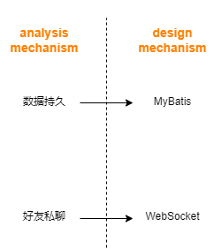

# MindMeet设计模型

[toc]

## 1. 概述

### 1.1. 设计进展


### 1.2. 平台框架

我们的项目使用分层框架，界面，业务逻辑，数据处理进行分层处理，整体依托于安卓平台与java语言开发，涉及到的相关技术栈列出如下：

- 安卓界面开发:使用`Android Studio`,`Android SDK`,`XML`开发与定义用户界面与布局
- 服务器框架：使用`REST API`来与服务器进行通信,在`Spring Boot`应用程序中构建RESTful Web服务，然后在安卓应用程序中使用HTTP协议来访问这些服务。
- 数据存储：我们使用Mybatis实现数据持久化，查询数据库，Oracle数据库来存储数据，使用Redis来满足高并发情况下数据的安全性和一致性。
- 日志信息：我们使用`Log4j`来记录日志信息，方便我们进行调试与错误处理。`Log4j`是Apache的一个开源日志框架，提供了丰富的日志级别、日志输出目的地、日志格式等配置选项，可以灵活地控制日志输出。
- 数据可视化：使用开源框架`Apache ECharts`来实现统计数据的可视化。

## 2. 架构完善

### 2.1. 平台依赖系统架构

我们对上次作业的系统架构分析进行了完善，重新对系统架构进行了划分，以下是最新的系统架构：


我们将控制层删除，应用逻辑层的子系统实现接口提供界面层调用，从而更改界面层状态；同时，我们将原有的子系统重新划分，划分为：

- 用户管理子系统：实现用户认证，好友管理功能
- 日程管理子系统：实现日程管理，记录跟踪功能
- 专注子系统：实现专注功能与线上自习室功能
- 交流圈子系统：实现专注记录分享，日程表分享，好友私聊功能

上次作业的系统架构分析中,我们注重于系统的功能划分,这次我们将更加注重于系统有关平台的依赖架构，平台依赖的系统架构如下图所示：


我们采用C/S架构设计，客户端使用`Android SDK`相关api绘制界面，应用逻辑层中四个子系统，调用`Android SDK`相关api进行逻辑操作，比如禁用通知，音频播放等功能。

服务器端通过`Spring Boot`框架部署`Rest Api`与客户端进行通信，通过开源框架`MyBatis`封装`JDBC`，进行数据库的访问与写入。同时，通用服务层使用`Log4j`进行日志输出，使用`Redis`提供数据缓存服务，满足高并发数据库查询需求。

### 2.2. 子系统与接口

为了更好提供我们的业务服务，根据我们的app涉及到的方面进行领域划分，同时针对app提供的功能在进一步划分为以下子系统：

- 用户管理子系统
- 专注子系统
- 日程管理子系统
- 交流圈子系统

**用户管理子系统**

| 编号  |              Rest Api              |                          接口描述                          |
| :---: | :--------------------------------: | :--------------------------------------------------------: |
|  001  |       POST api/user/register       | 该接口接受用户注册信息，返回是否注册成功，以及对应的userID |
|  002  |        PUT api/user/modify         |          该接口接受用户修改信息，返回是否修改成功          |
|  003  |        POST api/user/login         |          该接口接受用户登录信息，返回是否登录成功          |
|  004  |      GET api/user/?userID=id       |            该接口接受用户ID，返回用户的详细信息            |
|  005  |          DELETE api/user           |             该接口接受用户ID，删除该用户的信息             |
|  006  |   POST api/friendship/addFriend    |           该接口接受用户ID和好友ID，添加好友关系           |
|  007  | DELETE api/friendship/removeFriend |           该接口接受用户ID和好友ID，删除好友关系           |

**专注子系统**

| 编号  |         Rest Api          |                             接口描述                             |
| :---: | :-----------------------: | :--------------------------------------------------------------: |
|  008  |   POST api/focus/upload   |  该接口接受用户的一次上传专注记录，返回是否上传成功,以及专注id   |
|  009  | GET api/focus/?userID=id  |             该接口接受用户ID，返回用户的所有专注记录             |
|  010  | GET api/focus/?focusID=id |       该接口接受一个专注记录的id,返回此专注记录的所有信息        |
|  011  |  DELETE api/focus/delete  |          该接口接受专注ID，删除该专注记录，返回是否成功          |
|  012  |   POST api/room/create    | 该接口接受线上自习室创建信息，返回是否创建成功，以及对应的roomID |
|  013  |    PUT api/room/modify    |          该接口接受线上自习室修改信息，返回是否修改成功          |
|  014  |  GET api/room/?roomID=id  |         该接口接受线上自习室ID，返回线上自习室的详细信息         |
|  015  |  DELETE api/room/roomID   |          该接口接受线上自习室ID，删除该线上自习室的信息          |
|  016  |    POST api/room/join     |          该接口接受用户ID和线上自习室ID，加入线上自习室          |
|  017  |   DELETE api/room/leave   |          该接口接受用户ID和线上自习室ID，退出线上自习室          |


**日程管理子系统**

| 编号  |            Rest Api            |                       接口描述                       |
| :---: | :----------------------------: | :--------------------------------------------------: |
|  018  |    POST api/schedule/create    |  该接口接受用户的一次上传日程记录，返回是否上传成功  |
|  019  | GET api/schedule/?sheduleID=id |        该接口接受日程ID，返回该日程的详细信息        |
|  020  |      DELETE api/schedule       | 该接口接受日程ID，删除该日程的详细信息，返回是否成功 |
|  021  |  GET api/schedule/?userID=id   |       该接口接受用户id,返回用户所有日程的日程        |

**交流圈子系统**

| 编号  |            Rest Api            |                       接口描述                       |
| :---: | :----------------------------: | :--------------------------------------------------: |
|  022  |  POST api/circle/show/create   |      该接口接受用户的一次分享，返回分享是否成功      |
|  023  | GET api/circle/show/?showID=id |          该接口分享id，返回该分享的详细信息          |
|  024  |     DELETE api/circle/show     | 该接口接受分享id，删除该分享的详细信息，返回是否成功 |
|  025  | POST api/circle/comment/create |      该接口接受用户的一次评论，返回评论是否成功      |
|  026  | GET api/circle/comment/?showID |          该接口分享id，返回该分享的评论信息          |
|  027  |   DELETE api/circle/comment    |      该接口接受评论id，删除该评论，返回是否成功      |
|  028  |  POST api/circle/like/create   |      该接口接受用户的一次点赞，返回点赞是否成功      |
|  029  | GET api/circle/like/?showID=id |        该接口接受分享id，返回该分享的点赞信息        |
|  030  |     DELETE api/circle/like     |      该接口接受点赞id，删除该点赞，返回是否成功      |

### 2.3. 接口规范

我们的App允许第三方开发者开发其个人的数据可视化工具，因此对外提供查询用户个人专注信息，专注记录,以及日程信息，提供以下接口：

| 编号         | 001                                          |
| :----------- | :------------------------------------------- |
| REST API     | POST api/user/login                          |
| Interface    | login(userName: String,passWord:String):bool |
| Arguement    | userName: String,passWord:String             |
| Return Value | bool                                         |
| Introduction | 此接口使用户于外部平台登陆，返回登陆相关信息 |

| 编号         | 002                                        |
| :----------- | :----------------------------------------- |
| REST API     | GET api/schedule/?userID=id                |
| Interface    | getSchedule(userID: String):List<Schedule> |
| Arguement    | userID: String                             |
| Return Value | List<Schedule>                             |
| Introduction | 此接口通过userID查询用户日程表的列表       |

| 编号         | 003                                    |
| :----------- | :------------------------------------- |
| REST API     | GET api/focus/?userID=id               |
| Interface    | getFocus(userID: String):List<Focus>   |
| Arguement    | userID: String                         |
| Return Value | List<Focus>                            |
| Introduction | 此接口通过userID查询用户专注记录的列表 |

| 编号         | 004                                         |
| :----------- | :------------------------------------------ |
| REST API     | GET api/focus/?focusID=id                   |
| Interface    | getFocus(focusID: String):bool              |
| Arguement    | focusID: String                             |
| Return Value | bool                                        |
| Introduction | 此接口通过focusID查询用户专注记录的详细信息 |

| 编号         | 005                                        |
| :----------- | :----------------------------------------- |
| REST API     | GET api/schedule/?scheduleID=id            |
| Interface    | getSchedule(scheduleID: String):bool       |
| Arguement    | scheduleID: String                         |
| Return Value | bool                                       |
| Introduction | 此接口通过scheduleID查询用户日程的详细信息 |

以上接口所对应返回的json信息格式如下：
- 001：
```json
{
    "code": 200,
    "msg": "success",
    "data": {
        "userID": "123456",
        "userName": "张三",
        "userAvatar": "http://xxx.com/xxx.jpg",
    }
}
```

- 002:
```json
{
    "code": 200,
    "msg": "success",
    "data": [
        {
            "scheduleID": "123456",
            "scheduleName": "计算机网络",
            "scheduleTime": {
                  "startTime": "2020-12-12 12:12",
                  "endTime": "2020-12-12 15:12"
               },
            "scheduleContent": "计网作业",
            "scheduleType": "学习",
            "scheduleStatus": "未完成"
        },
        {
            "scheduleID": "111132",
            "scheduleName": "计算机系统结构",
            "scheduleTime": {
                  "startTime": "2020-11-11 13:00",
                  "endTime": "2020-12-12 15:00"
               },
            "scheduleContent": "计网作业",
            "scheduleType": "学习",
            "scheduleStatus": "未完成"
        }
    ]
}
```
- 003:
  ```json
  {
      "code": 200,
      "msg": "success",
      "data": [
         {
            "focusID": "123456",
            "focusTime": {
                  "startTime": "2020-11-14 15:00",
                  "endTime": "2020-11-14 17:00",
               },
         },
         {
            "focusID": "121388",
            "focusTime": {
                  "startTime": "2020-10-22 13:00",
                  "endTime": "2020-10-22 15:00",
               },
         },
      ],
  }
  ```

- 004:
   ```json
   {
         "code": 200,
         "msg": "success",
         "focusID": "121388",
         "focusTime": {
               "startTime": "2020-10-22 13:00",
               "endTime": "2020-10-22 15:00",
               },
   }
   ```

- 005:
   ```json
   {
         "code": 200,
         "msg": "success",
         "scheduleID": "123456",
         "scheduleName": "计算机网络",
         "scheduleTime": {
               "startTime": "2020-12-12 12:12",
               "endTime": "2020-12-12 15:12"
            },
         "scheduleContent": "计网作业",
         "scheduleType": "学习",
         "scheduleStatus": "未完成"
   }
   ```

### 2.4. 日程管理子系统接口示例

日程管理子系统一共提供以下接口：


## 3. 设计机制



### 3.1. 数据持久机制

#### 分析机制：

我们的MindMeet具有好友私聊和日程分享功能，随着时间的推移和用户量的增长，系统将持有大量的数据信息，如好友的聊天记录、用户的日程记录。通过将数据存储在共享的持久介质中，多个应用程序或用户可以共享和访问相同的数据。这种共享和协作可以实现数据的一致性和互操作性，促进不同系统之间的数据交换和集成。

什么是数据持久层呢？数据持久层的主要目的是实现数据的长期存储和管理，以确保数据在应用程序关闭、系统重启或断电等情况下仍然可用。它允许应用程序将数据从内存中持久化到物理存储介质中，以便在需要时进行读取和修改。数据持久层通常与数据库系统密切相关，它可以使用各种数据库管理系统（DBMS）来存储和检索数据，例如关系型数据库（如MySQL、Oracle）、面向对象数据库（如MongoDB）或内存数据库（如Redis）等。它还可以与文件系统、消息队列和其他持久化机制集成，以满足不同类型的应用程序需求。在数据持久层中，通常使用各种技术和方法来管理数据的存储和检索，例如数据访问对象（DAO）模式、对象关系映射（ORM）工具、查询语言（如SQL）和索引技术等。这些技术和方法可以简化数据操作的过程，并提供高效的数据管理和访问能力。

在此我们使用数据持久机制作为MindMeet的数据存储和访问，这样做的好处有：

1. 利于数据长期存储

   据持久机制确保数据在应用程序关闭、系统重启或断电等情况下仍然可用。将数据存储到持久介质中，如数据库或文件系统，可以避免数据丢失或不可恢复的情况。

2. 实现数据的一致性和互操作性，促进不同系统之间的数据交换和集成

   通过将数据存储在共享的持久介质中，多个应用程序或用户可以共享和访问相同的数据。

3. 拥有数据完整性和一致性

   通过使用事务和数据约束等机制，数据持久机制可以确保数据的完整性和一致性。它可以实施数据验证规则、强制执行数据完整性规则，并提供事务处理来保证数据的正确性和一致性。

4. 数据具有安全性

   数据持久机制提供了各种安全措施来保护存储的数据。它可以实施访问控制、加密、备份和灾难恢复等措施，以保护数据免受未经授权的访问、数据泄露和数据损坏等风险。

数据持久层（Data Persistence Layer）是指在计算机系统中负责将数据存储到持久介质（如硬盘、数据库）中，并能够在需要时检索和更新数据的部分。它是应用程序与底层数据存储之间的接口层。在MindMeet中数据持久层在我们的业务层（里面是我们的子系统）与数据库之间。持久层充当中间介质，可以将对象存储在数据库中，也可以将数据对象加载到内存中。在这样的抽象层作用下，程序只会间接访问数据库。


#### 实现机制：

​		现在有了数据持久层的分析机制(analysis mechanism)，于此将采用MyBatis做为其的实现机制(design mechanism)。

##### 什么是MyBatis?

1. MyBatis是一个半ORM（对象关系映射）框架，它内部封装了JDBC，开发时只需要关注SQL语句本身，不需要花费精力去处理加载驱动、创建连接、创建statement等繁杂的过程。程序员直接编写原生态sql，可以严格控制sql执行性能，灵活度高。

2. MyBatis 可以使用 XML 或注解来配置和映射原生信息，将 POJO映射成数据库中的记录，避免了几乎所有的 JDBC 代码和手动设置参数以及获取结果集。

3. 通过xml 文件或注解的方式将要执行的各种 statement 配置起来，并通过java对象和 statement中sql的动态参数进行映射生成最终执行的sql语句，最后由mybatis框架执行sql并将结果映射为java对象并返回。（从执行sql到返回result的过程）。

MyBatis的底层操作封装了JDBC的API，MyBatis的工作原理以及核心流程与JDBC的使用步骤一脉相承，MyBatis的核心对象（SqlSession，Executor）与JDBC的核心对象（Connection，Statement）相互对应。

##### MyBatis的工作原理

我们知道，JDBC有四个核心对象：

1. **DriverManager**，用于注册数据库连接
2. **Connection**，与数据库连接对象
3. **Statement/PrepareStatement**，操作数据库SQL语句的对象
4. **ResultSet**，结果集或一张虚拟表

而MyBatis也有四大核心对象：

1. **SqlSession**对象，该对象中包含了执行SQL语句的所有方法。类似于JDBC里面的Connection 。
2. **Executor**接口，它将根据SqlSession传递的参数动态地生成需要执行的SQL语句，同时负责查询缓存的维护。类似于JDBC里面的Statement/PrepareStatement。
3. **MappedStatement**对象，该对象是对映射SQL的封装，用于存储要映射的SQL语句的id、参数等信息。
4. **ResultHandler**对象，用于对返回的结果进行处理，最终得到自己想要的数据格式或类型。可以自定义返回类型。

MyBatis的工作原理如下图所示：


上面中流程就是MyBatis内部核心流程，每一步流程的详细说明如下文所述：

1. 读取MyBatis的配置文件。mybatis-config.xml为MyBatis的全局配置文件，用于配置数据库连接信息。
2. 加载映射文件。映射文件即SQL映射文件，该文件中配置了操作数据库的SQL语句，需要在MyBatis配置文件mybatis-config.xml中加载。mybatis-config.xml 文件可以加载多个映射文件，每个文件对应数据库中的一张表。
3. 构造会话工厂。通过MyBatis的环境配置信息构建会话工厂SqlSessionFactory。
4. 创建会话对象。由会话工厂创建SqlSession对象，该对象中包含了执行SQL语句的所有方法。
5. Executor执行器。MyBatis底层定义了一个Executor接口来操作数据库，它将根据SqlSession传递的参数动态地生成需要执行的SQL语句，同时负责查询缓存的维护。
6. MappedStatement对象。在Executor接口的执行方法中有一个MappedStatement类型的参数，该参数是对映射信息的封装，用于存储要映射的SQL语句的id、参数等信息。
7. 输入参数映射。输入参数类型可以是Map、List等集合类型，也可以是基本数据类型和POJO类型。输入参数映射过程类似于JDBC对preparedStatement对象设置参数的过程。
8. 输出结果映射。输出结果类型可以是Map、List等集合类型，也可以是基本数据类型和POJO类型。输出结果映射过程类似于JDBC对结果集的解析过程。

### 3.2.好友私聊机制

#### 分析机制：

MindMeet用于基础的信息交流功能，发送文字、表情，分享日程等。不像登录信息这种不需要很频繁或仅获取一次的数据，好友通讯需要我们通过网络传输的实时更新或连续数据流。信息传输需要具有可靠性和稳定性：信息传输应该是可靠和稳定的，确保信息能够有效地传递到目标地点。使用可靠的网络和通信设备，实施错误检测和纠正机制，以确保数据的准确性和完整性。

传统的请求-响应模式的 Web 开发在处理此类业务场景时，通常采用实时通讯方案，常见的是：

+ **轮询：**
  原理简单易懂，就是客户端通过一定的时间间隔以频繁请求的方式向服务器发送请求，来保持客户端和服务器端的数据同步。问题很明显，当客户端以固定频率向服务器端发送请求时，服务器端的数据可能并没有更新，带来很多无谓请求，浪费带宽，效率低下。

传统 Web 模式在处理高并发及实时性需求的时候，会遇到难以逾越的瓶颈，我们需要一种高效节能的双向通信机制（即**WebSocket**机制）来保证数据的实时传输。以下是两者的实现差别：


| HTTP                           | WEBSOCKET          |
| :----------------------------- | :----------------- |
| 单向协议                       | 双向通信           |
| 简单的RESTful应用              | 实时应用程序       |
| 只想获取一次数据供应用程序使用 | 经常更新的应用程序 |

#### 实现机制：

##### 什么是WebSocket？

WebSocket是一种基于TCP的通信协议，它提供了全双工、持久化的连接，允许在客户端和服务器之间进行实时的双向通信。WebSocket 的实现分为客户端和服务端两部分，客户端（通常为浏览器）发出 WebSocket 连接请求，服务端响应，实现类似 TCP 握手的动作，从而在浏览器客户端和 WebSocket 服务端之间形成一条 HTTP 长连接快速通道。两者之间后续进行直接的数据互相传送，不再需要发起连接和相应。

##### WebSocket的基本流程


1. 建立连接：
   - 客户端通过WebSocket协议发起连接请求，请求的目标是服务器的WebSocket端点（URL）。
   - 服务器接收到连接请求后，如果同意建立连接，将返回一个HTTP状态码101（切换协议）作为响应，表示切换到WebSocket协议。
   - 客户端接收到101响应后，确认连接建立成功。
2. 双向通信：
   - 一旦WebSocket连接建立成功，客户端和服务器之间可以进行实时的双向通信。
   - 客户端和服务器可以使用WebSocket提供的API方法，如send()和onmessage()来发送和接收消息。
   - 客户端和服务器可以随时发送消息给对方，并即时接收对方发送的消息，实现实时的双向通信。
3. 保持连接：
   - WebSocket连接是持久化的，保持活动状态，直到其中一方显式关闭连接或发生通信错误。
   - 客户端和服务器可以保持连接打开，以便随时进行通信，而无需频繁地创建和销毁连接。
   - 保持连接可以减少通信延迟，并允许实时通信的持续进行。
4. 关闭连接：
   - 客户端或服务器可以选择关闭WebSocket连接。
   - 关闭连接可以通过调用WebSocket对象的close()方法来实现。
   - 关闭连接后，客户端和服务器之间的通信将终止。

WebSocket的流程简单来说就是建立连接、进行双向通信、保持连接和关闭连接。这种实时的双向通信机制使得WebSocket在需要实时更新和实时交互的应用程序中非常有用。

## 4. 用例实现

## 5. 架构风格与关键决定

## 6. 原型进展

## 7. 存在的问题

## 8. 项目反思

## 9. 成员贡献

